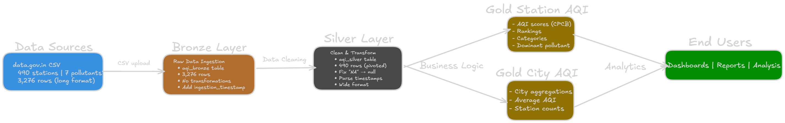

# Air Quality ETL Pipeline

Built a data pipeline to analyze air pollution across India because the air quality has been terrible lately and I wanted to work with real messy data instead of clean toy datasets.

## What It Does

Takes raw air quality readings from 490 monitoring stations across India and transforms them into something actually useful - ranked stations by pollution levels, city averages, and AQI scores following the official Indian government formula.

The data comes from data.gov.in and covers stations in Delhi, Mumbai, Bangalore, Patna, and dozens of other cities. Single day snapshot (Feb 14, 2026) with 7 different pollutants measured.

## The Pipeline


**Bronze → Silver → Gold (Medallion Architecture)**

**Bronze:** Raw CSV data dumped straight in. 3,276 rows (one per pollutant per station). Kept the mess.

**Silver:** Fixed the problems:
- "NA" strings → actual nulls
- Weird date format (DD-MM-YYYY) → proper timestamps  
- Pivoted from long to wide (now one row per station with all pollutants as columns)
- Down to 490 clean rows

**Gold:** Business-ready tables:
- Station rankings with AQI scores (0-500 scale)
- Which pollutant is worst at each location
- City-level averages
- Categories (Good/Moderate/Severe)

## What I Learned

This was my first real PySpark project. Main takeaways:

- Pivot is tricky - kept losing columns until I realized groupBy needs ALL the columns you want to keep
- `try_cast` is better than `when().cast()` for handling bad data
- Real air quality in India is legitimately terrible - most stations hit 500 (max severity)
- Pure PySpark expressions scale way better than UDFs
- Sometimes nulls should stay nulls (data integrity > filling everything)

## Challenges

**AQI Calculation:** The official CPCB formula has different breakpoint ranges for each pollutant. Converting this into efficient Spark code without using slow UDFs took some thinking. Ended up with a helper function that generates PySpark expressions dynamically.

**Data Quality:** 166 records had "NA" as strings. CO values go insanely high (60+ mg/m³). Not all stations measure all pollutants. Had to decide what to do with incomplete data - kept it in Silver, filtered it in Gold.

**Pivot Gotcha:** Forgot to include metadata columns in groupBy at first. Ended up with just station names and lost city, state, coordinates. Took me a while to figure out why.

## Tech Stack

- Databricks Community Edition
- PySpark for transformations
- Delta Lake for storage (ACID transactions, time travel)
- Unity Catalog for governance
- Python

## Results

Out of 490 stations:
- Majority showing Severe AQI (401-500)
- CO is often the dominant pollutant
- Some stations missing data (nulls filtered from final tables)

## Dataset

**Source:** data.gov.in  
**Coverage:** 490 stations across multiple Indian states  
**Date:** Feb 14, 2026 (single-day snapshot)  
**Pollutants:** PM2.5, PM10, SO2, NO2, CO, O3, NH3

## Running It

1. Upload CSV to `/FileStore/tables/` in Databricks
2. Run notebooks in order: Bronze → Silver → Gold
3. Query the Gold tables for insights

## What's Next

This project taught me batch ETL fundamentals. Planning to build:
- Project 2: Multi-source sales analytics with complex joins
- Project 3: Real-time fraud detection with streaming

Could come back and add API ingestion or historical data later, but for now this does what it needs to do.

## Files
```
air-quality-etl-databricks/
├── notebooks/
│   ├── 01_bronze_layer.py
│   ├── 02_silver_layer.py  
│   └── 03_gold_layer.py
├── data/
│   └── aqi_data.csv
├── images/
│   └── architecture.png
└── README.md
```

---

**Built this to learn Databricks and PySpark. First real data engineering project - learned way more from messy real data than I would have from clean examples.**
